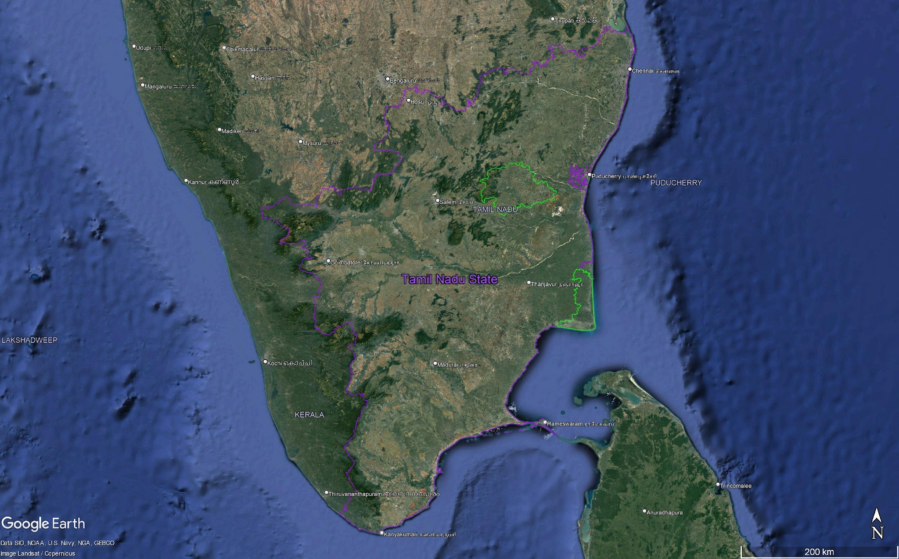

## Final Project:  Analysis of Temperature and PM 2.5 levels in Tamil Nadu

## Team Members:

- Mina Burns @mburns2002
- Priya Riley @PriyaRiley

## Background 
The purpose of this exploration is to use data from Low Cost Sensors (LCS) in habitations within rural Tamil Nadu to investigate relationships between temperature, humidity, and PM 2.5 levels in the region. 

## Data Source 
Data from low cost sensor network deployed in Tamil Nadu, districts Kallakurichi and Nagapattinam.
AAM-LASSI dataset. Ambient Air Monitoring of LPG At Scale in South India. 
This dataset comes from research with the Center for Occupational and Environmental Health. 

## Research Questions 
1. Look at connections between temperature and PM 2.5 in one village in India over a time period of about one year. 
2. Investigate relationship between humidity and PM 2.5 in one village in India over a time period of about one year. 
3. Compare the two districts, Kallakurichi and Nagapattinam (coastal and inland, respectively), for PM2.5 measurements. 

### Common files

- `README.md` this file, a general overview of the repository in markdown format.
- `priya-mina-final.Rmd`: our work for this assignment is contained in this Rmd file.  
- `.gitignore` Optional file, ignore common file types we don't want to accidentally commit to GitHub. Most projects should use this. 
- `<REPO-NAME>.Rproj` Optional, an R-Project file created by RStudio for it's own configuration.  Some people prefer to `.gitignore` this file.
- `dailymeans_outdoor_HH_cleaned.csv`: our dataset. 

### Infrastructure for Testing

- `DESCRIPTION` a metadata file for the repository, based on the R package standard. It's main purpose here is as a place to list any additional R packages/libraries needed for any of the `.Rmd` files to run.

