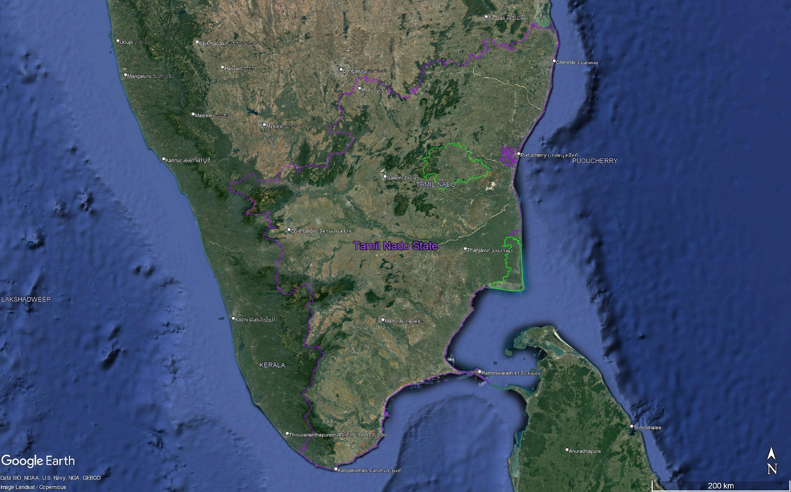

## Analysis of Temperature and PM2.5 levels in Tamil Nadu

*Description of the project:* For this project we will use data from Low
Cost Sensors (LCS) in habitations in rural Tamil Nadu to investigate
relationships between temperature, humidity and PM2.5 levels in the
region.

*Data required and how it is obtained:* Data from Low Cost Sensor (LCS)
network deployed in Tamil Nadu, districts Kallakurichi (KK) and Nagapattinam (NP).
AAM-LASSI dataset. Ambient Air Monitoring of LPG At Scale in South India
From Mina's research with the Center for Occupational and Environmental
Health.

**Three questions / analysis tasks:**

# Preliminary EDA - Priya - using the AQM_Inventory.xlsx

1)  Look at connections between temperature and PM2.5 in one district in
    India over a time period of about one year.

2)  Investigate relationship between humidity and PM2.5 in one district
    in India over a time period of about one year.

3)  Compare the two districts, Kallakurichi and Nagapattinam (coastal
    and inland, respectively), for PM2.5 measurements.

------------------------------------------------------------------------

## Preliminary EDA

```{r setup, include=FALSE}
#Read in packages
library("readxl")
library("base") 
library("data.table")
library("datasets")
library("DT")
library("dplyr")
library("ggplot2")
library("graphics")
library("readxl")
library("tidyr")
library("readr")
```

### Read in Data

```{r}
#urlfile <- "https://raw.githubusercontent.com/espm-157/final-group-mina_priya-final/master/dailymeans_outdoor_HH#_cleaned.csv?token=GHSAT0AAAAAACGN2DF6XHPFK3AQW5LIRRAGZLWMMIQ"
#read_csv(url(urlfile), show_col_types = FALSE)

#read the csv into r. The csv covers ambient and household emissions data in Tamil Nadu, India.
dailymeans_outdoor_emissons <- read_csv("dailymeans_outdoor_HH_cleaned.csv", show_col_types = FALSE)
dailymeans_outdoor_emissions <- dailymeans_outdoor_emissons[, -which(names(dailymeans_outdoor_emissons) == "...1")]
head(dailymeans_outdoor_emissions)
```

#### Cleaning and Preparing Data

```{r}
#filter where the qa_flags and da_flags are above 0, which means they have been flagged for an error.
cleaned_data = filter(dailymeans_outdoor_emissions, qa_flag == "0" & da_flag == "0")
cleaned_data
```

```{r}
#real quick, let's make sure that all variables are either humidity (rh), temperature (temp), or PM2.5
unique(cleaned_data$variable)
```

Great! Now lets move on to create one table for district KK and one for NP.

```{r}
#lets get one table for district KK and one for NP.  
KK_cleaned_emissions = filter(cleaned_data, district == "KK") 
NP_cleaned_emissions = filter(cleaned_data, district == "NP")
```

Great - all preliminary tables are set up. Now we can explore the data and our questions. 

#### Data visualizations using outdoor cleaned data

We will use district NP for the first 2 questions.

```{r}
#For our first two questions, we only need to look at the date, district, variable, and mean_of_medians.
NP_selected_data = select(NP_cleaned_emissions, c("date", "district", "variable", "mean_of_medians"))
head(NP_selected_data,10)
```
Above, we've shown the first 10 rows, which encompasses all data for October 28th, 2021. It is important to note that the variables have different amounts of inputs. For example, we can see that there are four rows for PM2.5, and three rows for both temp and rh. ????????????????? THIS IS BECAUSE WHY? ARE THERE MULTIPLE SENSORS???????

## 1) Look at connections between temperature and PM2.5 in one district in India over a time period of about one year.

In this case our chosen district is NP: Nagapattinam. This is a district in Tamil Nadu, India.

```{r}
#lets make new tables with columns for temp and PM2.5. Below, we show what these look like through the PM2.5 table.

filtered_pm2.5 = NP_selected_data %>%
  filter(variable == "pm2.5") %>%
  arrange(date, district) %>%
  mutate(pm2.5_values = mean_of_medians) %>%
  select("date","district","variable","pm2.5_values")
head(filtered_pm2.5, 10)

filtered_temp = NP_selected_data %>%
  filter(variable == "temp") %>%
  arrange(date, district) %>%
  mutate(temp_values = mean_of_medians) %>%
  select("date","district","variable","temp_values")
#head(filtered_temp) 
```

From this PM2.5 table above, we can see that each day contains differing amounts of data. Furthermore, as described above, each day had differing amounts of data per variable. As such, it will be easier to compare between variables and between dates if we summarize each day by taking the average PM2.5, temp, and so on. 

```{r}
#obtaining the average PM2.5 values per day
average_NP_pm2.5 = filtered_pm2.5 %>%
  group_by(date) %>%
  summarise(avg_pm2.5 = mean(pm2.5_values))
head(average_NP_pm2.5)
```

```{r}
#obtaining the average temp values per dat
average_NP_temp = filtered_temp %>%
  group_by(date) %>%
  summarise(avg_temp = mean(temp_values))
head(average_NP_temp)
```

Awesome. I now have tables with the average values of temp or PM2.5 per day. Now I can make some plots with these averages.

```{r}
ggplot() + 
  geom_point(data = average_NP_pm2.5, aes(x= date, y = avg_pm2.5), color = "lightblue") +
  geom_point(data = average_NP_temp, aes(x= date, y= avg_temp), color = "coral") +
  ggtitle("Avg Temperature and PM2.5 Concentrations per Day") + 
  labs(x= "Date", y = "Mean Values") +
  scale_x_date(date_labels = "%Y-%m-%d", date_breaks = "1 month") + 
  scale_y_continuous(breaks = seq(0, 100, 15)) + 
  theme_bw() +
  theme(axis.text.x = element_text(angle = 45, hjust = 1))
```

This is a plot with the average temperatures plotted over the average PM2.5 concentrations.
The makeup of this graph isn't super helpful to me because the scales are pretty different. 

```{r}
#combined plot

combined_plot <- ggplot() +
  geom_line(data = average_NP_temp, aes(x = date, y = avg_temp, group = 1), color = "coral") +
  geom_line(data = average_NP_pm2.5, aes(x = date, y = avg_pm2.5, group = 1), color = "lightblue3") +
  ggtitle("Avg Temperature and PM2.5 Concentrations per Day") +
  labs(x = "Date", y = "PM2.5 Mean Values") +
  scale_x_date(date_labels = "%Y-%m-%d", date_breaks = "2 month") +
  scale_y_continuous(
    name = "PM2.5 Mean Values",
    sec.axis = sec_axis(~., name = "Temperature", breaks = (c(0, 20, 30, 40)))
  ) +
  theme_bw() + 
  theme(axis.text.x = element_text(angle = 45, hjust = 1),
        axis.line.y.right = element_line(color = "coral"), 
        axis.ticks.y.right = element_line(color = "coral"),
        axis.text.y.right = element_text(color = "coral"),
        axis.title.y.right = element_text(color = "coral1")
        )

combined_plot
```

This graph includes both variables in the same plot. It was difficult to scale so it did not end up being as helpful as we hoped. Lets break it down and see if that helps.

```{r}
#plot avg temperature per day alone
avg_temp_plot = ggplot() + 
  geom_point(data = average_NP_temp, aes(x=date, y=avg_temp), color = "coral") +
  ggtitle("Avg Temperature Values per Day") + 
  labs(x= "Date", y = "Mean Values") +
  scale_x_date(date_labels = "%Y-%m-%d", date_breaks = "2 month") + 
  scale_y_continuous(breaks = seq(0, 40, 5)) + 
  theme_bw() + 
  theme(axis.text.x = element_text(angle = 45, hjust = 1))
avg_temp_plot
```

Above, the Avg Temperatures per Day plot shows that the temps fluctuate up and down. Higher temps occur from 2022-04 (April) to 2022-07 (July) in 2022, and 2023-04 (April) to 2023-06 (June) in 2023. 

```{r}
avg_pm25_plot = ggplot() + 
  geom_point(data = average_NP_pm2.5, aes(x=date, y = avg_pm2.5), color = "lightblue") +
  ggtitle("Avg PM2.5 Concentrations per Day") + 
  labs(x= "Date", y = "Mean Values") +
  scale_x_date(date_labels = "%Y-%m-%d", date_breaks = "2 month") + 
  scale_y_continuous(breaks = seq(0, 100, 15)) + 
  theme_bw() +
  theme(axis.text.x = element_text(angle = 45, hjust = 1))
avg_pm25_plot
```

From our plot above, we see that lower levels of PM2.5 concentrations occur from 2022-04 to 2022-09 (or April - September in 2022), and 2022-07 (July) in 2023 which is interesting. Let's look at these plots next to each other so that we can compare temperature and PM2.5.

```{r}
#the graphs next to each other
require(gridExtra)
grid.arrange(avg_temp_plot, avg_pm25_plot, ncol=2)
```

From the graphs above, for temperature, we can see that the months of April (2022-04) - July (2022-07) experience higher temperatures. This makes sense because these are summer months in Tamil Nadu. On the other hand, the months of December (2022-12) to March (2023-03) experience lower temperatures, which coincides with the winter months of Tamil Nadu, India. Meanwhile, we can see that peak PM2.5 concentrations occur from December (2022-12) to March (2023-03), which also generally aligns with colder months. 

This makes sense, as the PM2.5 measurements are taken from sensors that are placed near village homes for the purpose of detecting PM2.5 from cook stoves. During winter months, cook stoves are used more often for warmth and for heating food, thus it makes sense that higher PM2.5 concentrations occur during colder months. Likewise, it makes sense that lower PM2.5 concentrations are recorded during times of higher temperatures; there is overlap from the higher temperatures from 2022-05 to 2022-07, with lower PM2.5 concentrations at the same time. 

```{r}
avg_temp_plot_line = ggplot() + 
  geom_line(data = average_NP_temp, aes(x=date, y=avg_temp, group = 1), color = "coral") +
  ggtitle("Avg temperature values per day") + 
  labs(x= "Date", y = "Mean Values") +
  scale_x_date(date_labels = "%Y-%m-%d", date_breaks = "2 month") +
  scale_y_continuous(breaks = seq(0, 40, 5)) + 
  theme_bw() +
  theme(axis.text.x = element_text(angle = 45, hjust = 1))

avg_pm25_plot_line = ggplot() + 
  geom_line(data = average_NP_pm2.5, aes(x = date, y = avg_pm2.5, group = 1), color = "lightblue3") +
  ggtitle("Avg PM2.5 concentrations per day") + 
  labs(x= "Date", y = "Mean Values") +
  scale_x_date(date_labels = "%Y-%m-%d", date_breaks = "2 month") + 
  scale_y_continuous(breaks = seq(0, 100, 15)) + 
  theme_bw() +
  theme(axis.text.x = element_text(angle = 45, hjust = 1))

require(gridExtra)
grid.arrange(avg_temp_plot_line, avg_pm25_plot_line, ncol=2)

```
This plot lets us see the general trend that higher temps connect with lower PM2.5, and higher PM2.5 occurs during lower temps. 


## 2.) Investigate relationship between humidity and PM2.5 in one village in India over a time period of about one year.

Background on humidity in Tamil Nadu, India: 
The most humid month of the year is November, with humidity varies from 59.1% to 96.9%. The least humid month is of the year is June, with humidity varies from 41.7% to 87.0% (indianclimate.com).

```{r}
#From the first question, I already have filtered and cleaned data for PM2.5. Now let's do the same for humidity. 

filtered_rh = NP_selected_data %>%
  filter(variable == "rh") %>% #'rh' stands for registered humidity
  arrange(date, district) %>%
  mutate(rh_values = mean_of_medians) %>%
  select("date","district","variable","rh_values")
head(filtered_rh)
```

```{r}
average_NP_rh = filtered_rh %>%
  group_by(date) %>%
  summarise(avg_rh = mean(rh_values))

head(average_NP_rh)
```

```{r}
ggplot() + 
  geom_point(data = average_NP_pm2.5, aes(x= date, y = avg_pm2.5), color = "lightblue") +
  geom_point(data = average_NP_rh, aes(x= date, y= avg_rh), color = "gold2") +
  ggtitle("Avg Humidity and PM2.5 Concentrations per Day") + 
  labs(x= "Date", y = "Mean Values") +
  scale_x_date(date_labels = "%Y-%m-%d", date_breaks = "1 month") + 
  scale_y_continuous(breaks = seq(0, 100, 15)) + 
  theme_bw() + 
  theme(axis.text.x = element_text(angle = 45, hjust = 1))
```

It looks like humidity and PM2.5 follow somewhat similar patterns. When PM2.5 rises during the Winter, humidity also seems to rise around the same time (during Fall through Winter). When PM2.5 has a decreasing trend starting in 2021-10 and going to 2022-07, humidity also has a decreasing trend. 


```{r}
avg_rh_plot = ggplot() + 
  geom_point(data = average_NP_rh, aes(x=date, y=avg_rh), color = "gold2") +
  ggtitle("Avg Humidity Values per Day") + 
  labs(x= "Date", y = "Mean Values") +
  scale_x_date(date_labels = "%Y-%m-%d", date_breaks = "2 month") + 
  theme_bw() + 
  theme(axis.text.x = element_text(angle = 45, hjust = 1))

avg_rh_plot
```
These graphs allow us to look at the two plots more closely. From 2021-11 to 2022-05, humidity experiences a decreasing general trend. Its highest values seem to be around 2022-09 to 2023-02, which are the colder months.

```{r}
avg_pm25_plot
```

From 2021-11 to 2022-07, PM2.5 experiences a general decreasing trend. Its highest values seem to be around 2021-11 to 2022-01, and 2022-11 to 2023-01. This coincides with typically colder months. 

```{r}
#the graphs next to each other
require(gridExtra)
grid.arrange(avg_rh_plot, avg_pm25_plot, ncol=2)
```

We can see that humidity and PM2.5 concentrations seem to be somewhat correlated. Higher humidity values seem to also correspond to higher PM2.5 concentrations. This makes sense because in Tamil Nadu, India, the more humid months occur during the colder months - so when cook stoves are more likely to be used when it's cold, it also happens to be humid. 

```{r}
rh_and_pm2.5_plot <- ggplot() +
  geom_line(data = average_NP_rh, aes(x = date, y = avg_rh, group = 1), color = "gold2") +
  geom_line(data = average_NP_pm2.5, aes(x = date, y = avg_pm2.5, group = 1), color = "lightblue3") +
  ggtitle("Avg Humidity and PM2.5 Concentrations per Day") +
  labs(x = "Date", y = "PM2.5 Mean Values") +
  scale_x_date(date_labels = "%Y-%m-%d", date_breaks = "2 month") +
  scale_y_continuous(
    name = "PM2.5 Mean Values",
    sec.axis = sec_axis(~., name = "Humidity", breaks = (c(seq(0,90,10)))
  )) +
  theme_bw() + 
  theme(axis.text.x = element_text(angle = 45, hjust = 1),
        axis.line.y.right = element_line(color = "gold2"), 
        axis.ticks.y.right = element_line(color = "gold2"),
        axis.text.y.right = element_text(color = "gold2"),
        axis.title.y.right = element_text(color = "gold2"))

rh_and_pm2.5_plot
```
Again, we see the general trends are similar.

We should note that there a potential complexity with the data. Though it could make sense that humidity and PM2.5 are this closely aligned, because Tamil Nadu typically truly does humidity during colder months, it is also possible that the sensor has some inaccuracies. These measurements were collected from a Low Cost Sensor (LCS) network deployed in Tamil Nadu, in districts Kallakurichi (KK) and Nagapattinam (NP). ???????????????????????????????????? While these low cost sensors do tend to be accurate, they are not built specifically for humidity, especially for recording higher values of humidity. As such, we would like to note that it is possible that there should be some caution when it comes to claiming how similar humidity and PM2.5 truly are.  

```{r}
require(gridExtra)
grid.arrange(avg_temp_plot, avg_rh_plot, avg_pm25_plot, ncol=3)
```
Lastly, here are all three variables plotted together. We can see that temperature is somewhat inversely relational with humidity and PM2.5. Higher temperatures coincide with lower humidity and PM2.5 values, and vice versa. This is backed up by [Ding et al. 2021](https://pubmed.ncbi.nlm.nih.gov/34708953/).

## Question 3




Notes: - flag represents data availability (da flag) - flagsum is
greater than 0 (qa flag)

3)  Compare the two districts, Kallakurichi and Nagapattinam (coastal
    and inland, respectively), for PM2.5 measurements.

```{r setup, include=FALSE}
# loads in multiple packages at once and install packages
# if they are not installed locally
pacman::p_load(readxl, 
               base,
               data.table,
               DT,
               dplyr,
               ggplot2,
               graphics,
               readxl,
               tidyr,
               readr, 
               lubridate)
```

## read in data

```{r}
dailymeans <- read_csv("dailymeans_outdoor_HH_cleaned.csv", show_col_types = FALSE)
dailymeans <- dailymeans[, -which(names(dailymeans) == "...1")]
head(dailymeans)
```

### Data Cleaning

```{r}
# filter out data with qa and da flags (quality and data availability flags)

dailymeans <- dailymeans |> 
  filter(qa_flag == 0 & da_flag == 0) |> 
  select(-c(qa_flag, da_flag)) # drop these columns as no longer needed now 
```

### Analysis

Start analysis for question 3 Compare the two districts, Kallakurichi
and Nagapattinam (coastal and inland, respectively), for PM2.5
measurements.)

### Initial Visualization

```{r}
# filter for pm2.5 
dailymeans |> 
  filter(variable == "pm2.5") |> # filter for pm2.5 
  ggplot() + 
  geom_line(aes(x = date, mean_of_medians, color = district), alpha = 0.6) +
  theme_bw()
```

> Initial visualization shows up that there is a gap in the time that
> each district has data. Next, will subset to the dates that both
> districts are represented for.

```{r}
# what date is KK first represented? 
dailymeans |> filter(district == "KK") |> 
  arrange((date))
```

```{r}
# what does KK data go until? 
dailymeans |> filter(district == "KK") |> 
  arrange(desc(date))
```

```{r}
# filter for dates that KK is represented in 
filtered_dates <- dailymeans |> 
  filter(date > "2022-08-04" & date < "2023-03-15") |> 
  filter(variable == "pm2.5")  # filter for pm2.5 
  
ggplot(data = filtered_dates) + 
  geom_line(aes(x = date, mean_of_medians, color = district), alpha = 0.6) +
  theme_bw()
```

> Nice, this is a better visualization. Let's improve the plot, add
> labels, and see what they look like on separate plots.

```{r}
filtered_dates |>
  ggplot() + 
  geom_line(aes(x = date, mean_of_medians, color = district), alpha = 0.5) + 
  labs(title = "Average PM2.5 over Time for Two Districts", x = "Date", y = "Average PM2.5") + 
  scale_x_date(date_breaks = "1 month" , date_labels = "%b-%y") + 
  theme_bw()
```

```{r}
filtered_dates |>
  ggplot() + 
  geom_line(aes(x = date, mean_of_medians, color = district), alpha = 0.5) + 
  labs(title = "Average PM2.5 over Time for Two Districts", x = "Date", y = "Average PM2.5") + 
  theme_bw() + 
  scale_x_date(date_breaks = "1 month" , date_labels = "%b-%y") + 
  facet_wrap(~district, ncol = 2) + 
  theme(axis.text.x = element_text(angle = 90, hjust = 1))
```

```{r}
tab <- filtered_dates |>
  group_by(district) |>
  summarize(average = mean(mean_of_medians),
            se = sd(mean_of_medians) / sqrt(n()))
tab
```

```{r}
tab |> 
  ggplot() + 
  geom_col(aes(x = district, y = average, fill = district), color = "black") + 
  scale_y_continuous(breaks = seq(0, 50, 5)) + 
  theme_bw() + 
  labs(title = "Average PM2.5 per District", x = "District", y = "Average PM2.5")
```

```{r}
filtered_dates |>
  ggplot() + 
  geom_point(aes(x = date, mean_of_medians, color = district), alpha = 0.6) + 
  labs(title = "Average PM2.5 over Time for Two Districts", x = "Date", y = "Average PM2.5") + 
  theme_bw() + 
  scale_x_date(date_breaks = "1 month" , date_labels = "%b-%y") + 
  facet_wrap(~district, ncol = 2) + 
  theme(axis.text.x = element_text(angle = 90, hjust = 1))
```

```{r}
filtered_dates |>
  ggplot() + 
  geom_density(aes(x = mean_of_medians, fill = district), alpha = 0.5) + 
  labs(title = "Average PM2.5 Density", x = "Average PM2.5", y = "Density") + 
  theme_bw() 
```

### Analysis Results

> We see based on the results on the analysis that Kallakurichi (KK) has a higher average PM2.5, 
while Nagapattinam (NP) has lower average PM2.5. Referencing the map again, we can see that Kallakurichi is 
inland, and Nagapattinam is coastally located. Thus, one explanation for the differences between the PM2.5 for the two districts is the potential coastal influence of NP. The influx of wind from the sea can blow away particulate matter, reducing the average PM2.5 ratings picked up by the sensors. KK in quite far inland, so it wouldn't experience the same winds from the sea, which may explain why it has higher PM2.5 sensor readings. 